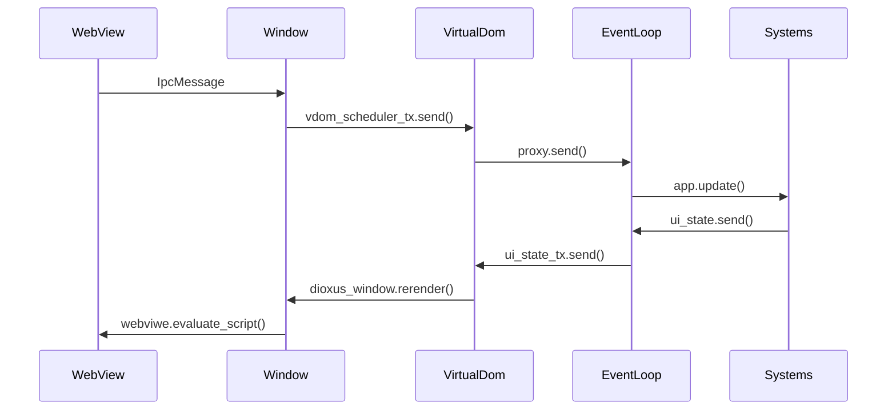
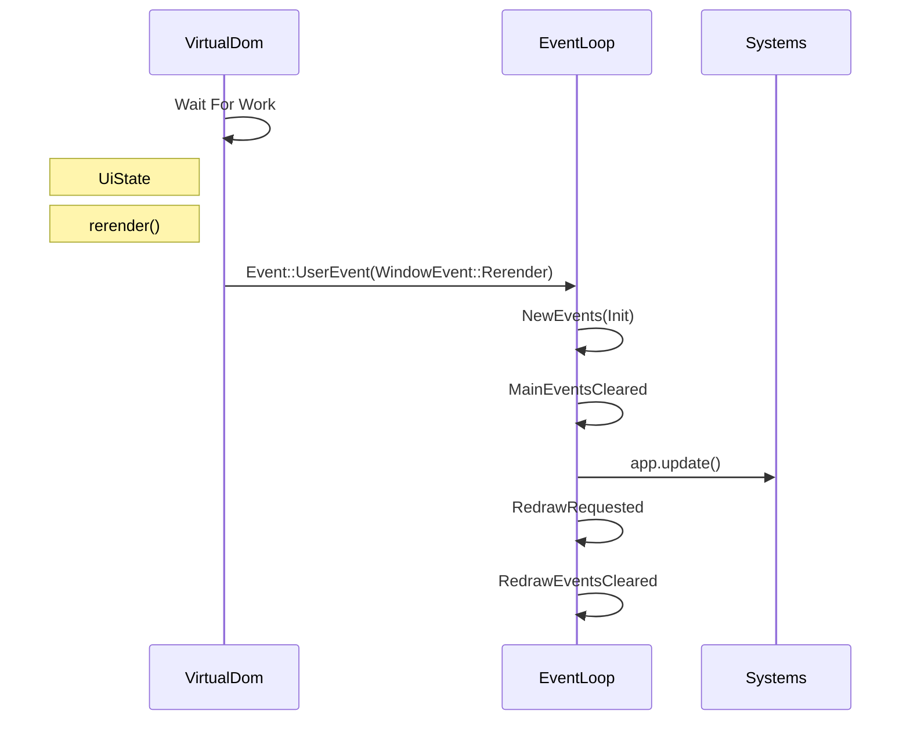
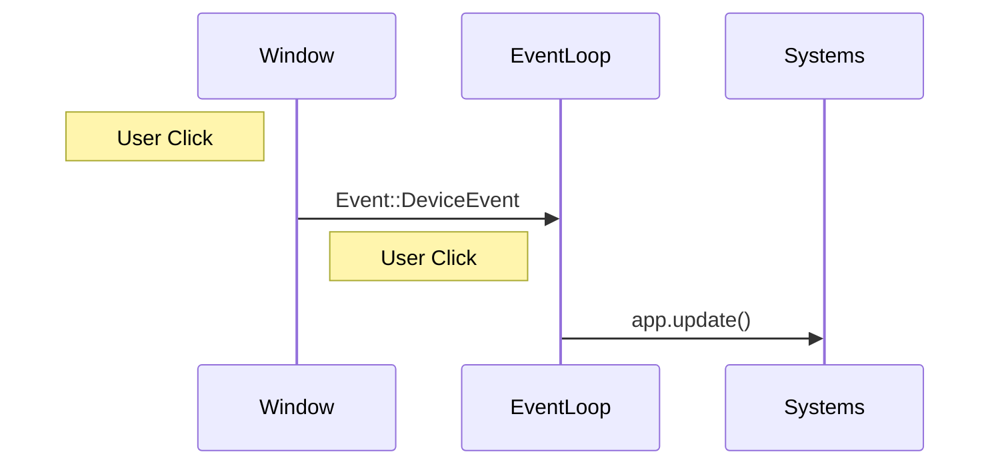
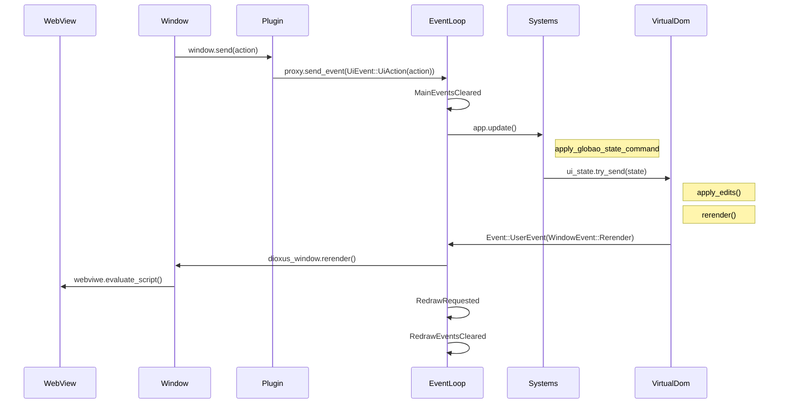

## Channels
```rust
let (vdom_scheduler_tx, vdom_scheduler_rx) = futures_channel::mpsc::unbounded::<SchedulerMsg>();
let (ui_state_tx, ui_state_rx) = tokio::sync::mpsc::channel::<UiState>(8);
let (ui_action_tx, ui_action_rx) = tokio::sync::mpsc::channel::<UiAction>(8);
let proxy = event_loop.create_proxy();
```



## Render cycle



### When user clicks screen



### UiAction

