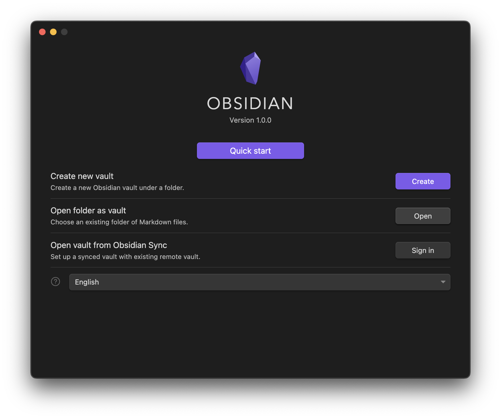
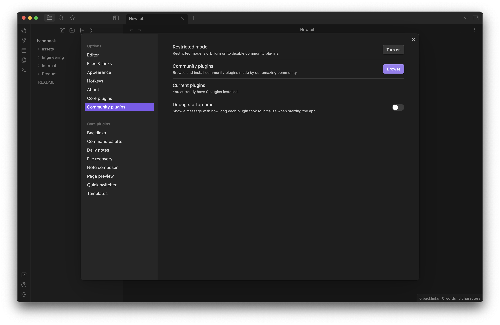
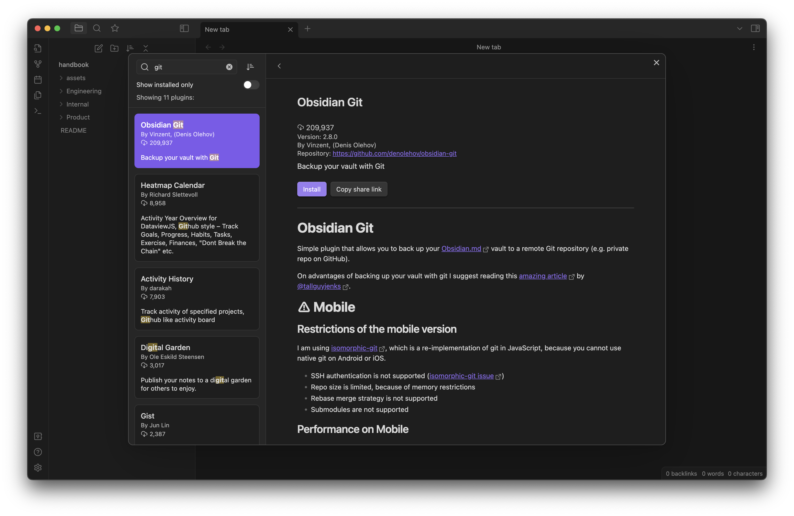
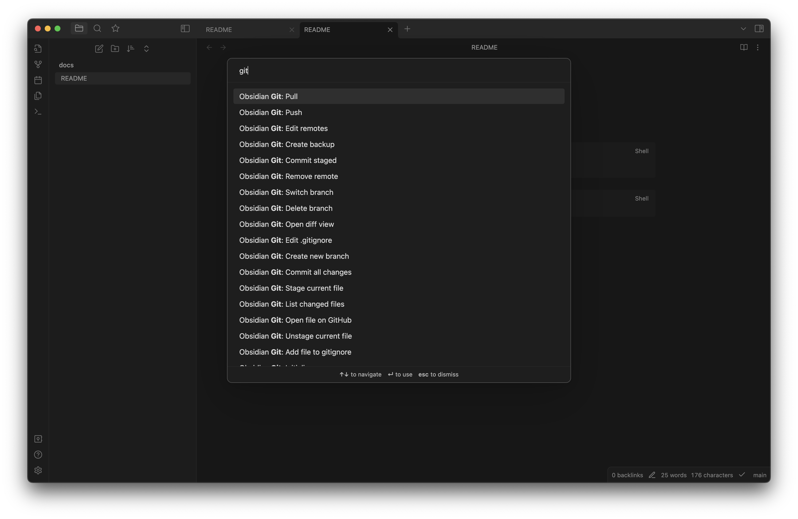

# dip handbook

All our knowledge in one place.
- Handbook first approach
- Single source of truth
- Easily editable via Obsidian
- Git version control
- find more: [Product - Handbook](Product/Handbook.md)


## Installation

Install Obsidian (macOS)
```sh
brew install obsidian gh
```

Clone repository
```sh
gh repo clone diptools/dip
# or if you have access to diptools/handbook-internal repository
gh repo clone diptools/dip -- --recursive
 
cd dip
```

## Setup

### Open Vault
1. Start Obsidian app
2. Click "Open folder as vault" -> "Open"
3. Select `packages/handbook` directory in dip repository


### Enable Community plugins
1. Open "Settings" (`⌘ + ,`) -> "Options" -> "Community Plugins" -> "Turn on community plugins"
2. Click "Community plugins" -> "Browse"
	-    
3. Find these plugins
	- [Obsidian Git](https://github.com/denolehov/obsidian-git)
	- [Linter](https://github.com/platers/obsidian-linter)
4. Click "Install" and "Enable"
	- 

### Pull / Commit / Push
1. Press command `⌘ + P`
2. Search for `git`
	
### Editing Internal handbook
There are two ways to commit changes and push to handbook-internal repository
1. Directly open `packages/handbook/Inside/` directory with Obsidian
	- Follow [Open Vault](#Open%20Vault) step but this time, select `packages/handbook/Internal` directory instead in step 3
2. Via git command line tool
```sh
cd packages/handbook/Internal

git add -A
git commit -m "Your commit message"
git push
```
