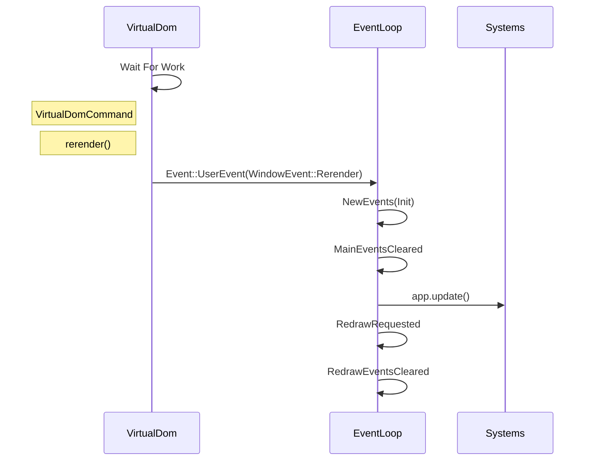
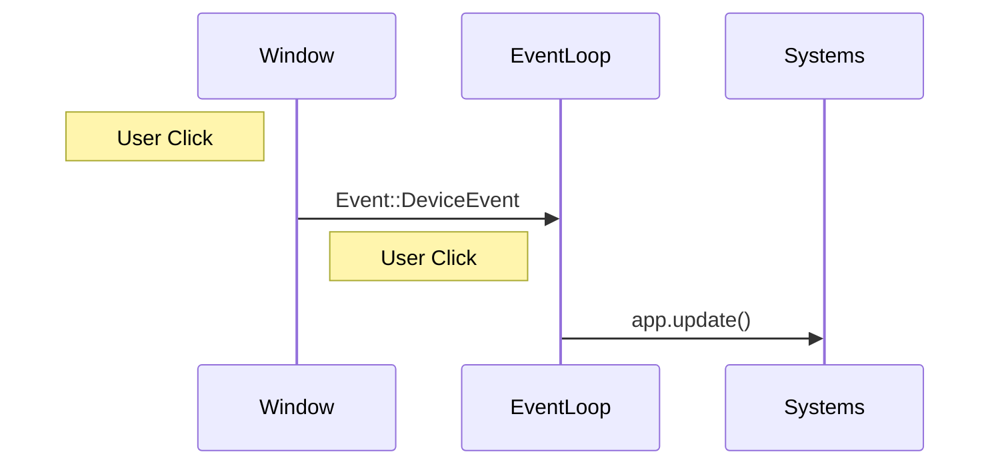
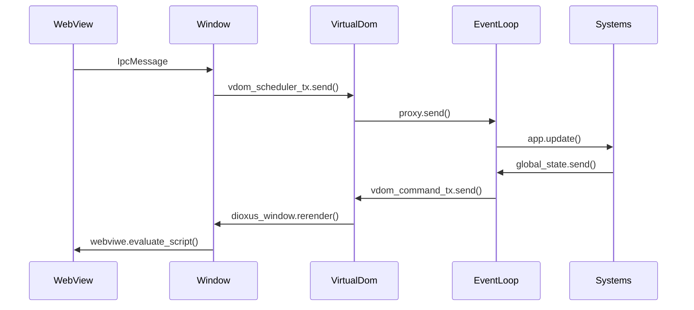

+++
title = "Overview"
weight = 0
+++


## Render cycle



### When user clicks screen



## Channels
```rust
let (vdom_scheduler_tx, vdom_scheduler_rx) = mpsc::unbounded::<SchedulerMsg>();
let (vdom_command_tx, vdom_command_rx) = channel::<VirtualDomCommand<GlobalState>>(8);
let (core_tx, core_rx) = channel::<CoreCommand>(8);
let proxy = event_loop.create_proxy();
```


