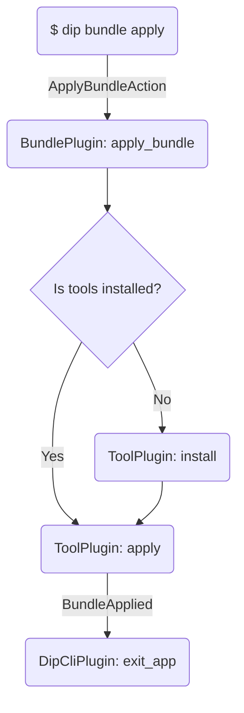

```mermaid
graph TD
	A($ dip bundle apply) --> |ApplyBundleAction| B(BundlePlugin: apply_bundle)
	B --> C{Is tools installed?}
	C --> |Yes| D(ToolPlugin: apply)
	C --> |No| E(ToolPlugin: install)
	E --> D(ToolPlugin: apply)
	D --> |BundleApplied| F(DipCliPlugin: exit_app)
```

